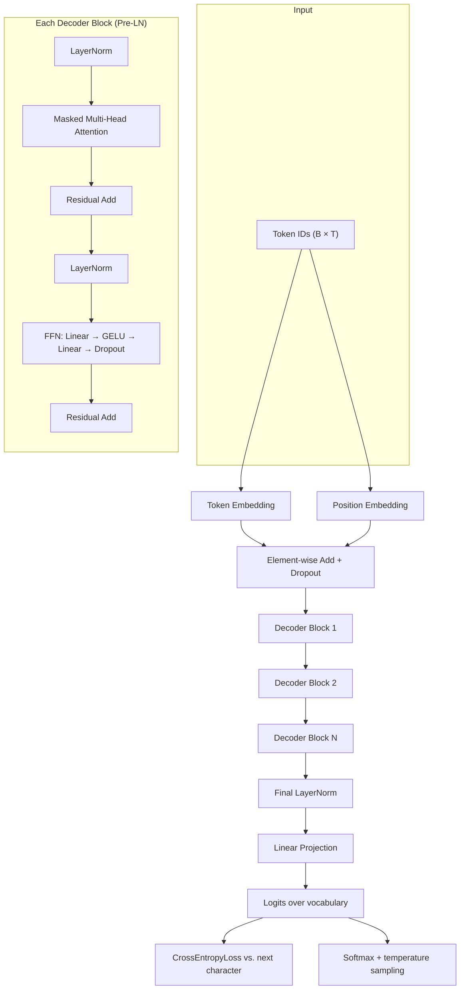

# Shakespeare-LLM-From-Scratch

A compact, **decoder-only Transformer (Mini-LLM)** built and trained from scratch in PyTorch on Shakespeare's collected works.

No Hugging Face models. No pretrained weights. The architecture, character-level tokenizer, training loop, and autoregressive sampler are implemented by hand so the full path from raw text to generated verse is visible in a few files.

[](https://www.python.org/)
[](https://pytorch.org/)
[](#architecture--data-flow)
[](#license)

---

## About The Project

Large language models look opaque from the outside. This repository is a small, complete GPT-style stack that makes the internals inspectable:

- **Token embeddings** map each character to a learned vector.
- **Learned positional embeddings** tell the model *where* each character sits in the context window.
- **Stacked Pre-LN decoder blocks** combine causal multi-head self-attention with a GELU feed-forward network and residual connections.
- **Next-character prediction** with cross-entropy loss is the only training objective.
- **Autoregressive decoding** samples one character at a time, with temperature controlling how conservative or inventive the output is.

The result is not a production chatbot. It is a working Mini-LLM you can train on a laptop, checkpoint, and prompt — the same loop that scales to GPT-class models, reduced to a size you can reason about.

Dataset: [Tiny Shakespeare](https://raw.githubusercontent.com/atilsamancioglu/ShakespeareInput/refs/heads/main/input.txt) (~1M characters of plays and verse). The first run downloads it into `data/shakespeare.txt`.

---

## Key Features

- **From-scratch PyTorch architecture** — decoder-only GPT with no third-party transformer libraries
- **Causal multi-head self-attention** — upper-triangular mask so each position can attend only to itself and the past
- **Pre-LN transformer blocks** — LayerNorm before attention and MLP (GPT-2 / GPT-3 style), residual connections after
- **Learned positional encodings** — `nn.Embedding` over the context window, added to token embeddings
- **Character-level tokenization** — ~65 unique symbols; encode/decode without BPE or external vocab files
- **Next-token training objective** — input/target pairs shifted by one character, CrossEntropyLoss
- **Stable training loop** — AdamW, linear LR warmup, gradient clipping, periodic train/val evaluation
- **Checkpointing** — weights, config, iteration count, and validation loss saved to `checkpoints/model.pt`
- **Autoregressive text generation** — temperature sampling, prompt-based inference, optional interactive mode

---

## Architecture & Data Flow

### Model

```
Token IDs  (B, T)
    │
    ├─► Token Embedding      (vocab → d_model)
    └─► Position Embedding   (block_size → d_model)
              │
              ▼
         Dropout(sum)
              │
    ┌─────────┴─────────┐
    │  × N Decoder Blocks│
    │                   │
    │  x → LayerNorm    │
    │    → Masked MHA   │
    │    → + residual   │
    │    → LayerNorm    │
    │    → FFN (4×, GELU)│
    │    → + residual   │
    └─────────┬─────────┘
              ▼
         Final LayerNorm
              ▼
         Linear (d_model → vocab)
              ▼
         Logits  (B, T, vocab)
```

Default **training** configuration (`train.py`):

| Hyperparameter | Value | Role |
| --- | --- | --- |
| `embedding_dim` | 128 | Residual stream width |
| `num_heads` | 4 | Parallel attention heads (`head_dim = 32`) |
| `num_layers` | 3 | Stacked decoder blocks |
| `block_size` | 128 | Context window (characters) |
| `dropout` | 0.1 | Regularization on embeddings, attention, and MLP |
| `batch_size` | 32 | Sequences per step |
| `max_iters` | 500 | Training steps |
| `learning_rate` | 3e-4 | Peak AdamW LR after warmup |
| `warmup_iters` | 100 | Linear LR ramp from 0 → 3e-4 |

This compact setup trains in minutes on CPU or a single GPU. `model.py` also accepts larger defaults (`d_model=384`, `heads=6`, `layers=6`, `block_size=256`) if you want more capacity.

### Mermaid — architecture



### Mermaid — data and training flow

```mermaid
flowchart LR
    raw["shakespeare.txt"] --> tok["CharacterTokenizer"]
    tok --> split["90% train / 10% val tensors"]
    split --> batch["get_batch: x, y = x shifted by 1"]
    batch --> gpt["GPT forward"]
    gpt --> ce["Cross-entropy loss"]
    ce --> opt["AdamW + warmup + grad clip"]
    opt --> ckpt["checkpoints/model.pt"]
    ckpt --> gen["generate.py — autoregressive decode"]
    gen --> text["Shakespeare-like text"]
```



---

## Project Structure

```
Shakespeare-LLM-From-Scratch/
├── model.py            # GPT: embeddings, Pre-LN blocks, causal MHA, generate()
├── train.py            # Training loop, LR warmup, eval, checkpoint save
├── generate.py         # Load checkpoint, prompt-based + interactive inference
├── dataset.py          # Download, character tokenizer, batches, train/val split
├── requirements.txt
├── data/
│   └── shakespeare.txt # Tiny Shakespeare (downloaded on first run)
└── checkpoints/
    └── model.pt        # Written after training
```

| File | Responsibility |
| --- | --- |
| `model.py` | Decoder-only Transformer: token/position embeddings, causal mask, Multi-Head Attention, LayerNorm, GELU MLP, next-token loss, autoregressive `generate()` |
| `train.py` | Data load, AdamW, linear warmup, gradient clipping, loss logging, sample generations during training, checkpoint write |
| `generate.py` | Restore config + weights, encode prompt, sample with temperature, print or interactive REPL |
| `dataset.py` | Dataset download, `CharacterTokenizer`, 90/10 split, random `(x, y)` batches |

---

## Installation

**Requirements:** Python 3.10+ recommended. A CUDA GPU is optional; the scripts fall back to CPU.

```bash
git clone https://github.com/SdRy69/Shakespeare-LLM-From-Scratch.git
cd Shakespeare-LLM-From-Scratch

python -m venv .venv

# Windows
.venv\Scripts\activate

# macOS / Linux
source .venv/bin/activate

pip install -r requirements.txt
```

`dataset.py` creates `data/` and downloads Tiny Shakespeare on the first `load_data()` / `download_shakespeare()` call. You do not need to fetch the corpus by hand.

---

## How to Train

```bash
python train.py
```

What happens:

1. Tiny Shakespeare is downloaded (if missing) and tokenized at character level.
2. A GPT is built with the hyperparameters at the top of `train.py`.
3. Each step samples a batch, runs a forward pass, clips gradients (`max_norm=1.0`), and updates with AdamW.
4. Every `EVAL_INTERVAL` steps (default 100), train/val loss is printed and a short sample is generated from the prompt `ROMEO:`.
5. The run writes `checkpoints/model.pt` (state dict, config, iteration, val loss).

To scale the experiment, edit the constants in `train.py` (`EMBEDDING_DIM`, `NUM_LAYERS`, `BLOCK_SIZE`, `MAX_ITERS`, …) and re-run. Keep `embedding_dim` divisible by `num_heads`.

---

## How to Generate Text

Train first so `checkpoints/model.pt` exists, then:

```bash
python generate.py
```

The script:

- loads architecture from the checkpoint `config` (so training and inference stay in sync)
- generates from built-in prompts (`ROMEO:`, `To be, or not to be`, `JULIET:`)
- then waits for your own prompt (`quit` / `exit` / `q` to stop)

Generation is autoregressive: the model predicts one character, appends it, and repeats until `max_new_tokens`. If the context grows past `block_size`, only the last `block_size` characters are fed in.

**Temperature** (default `0.8` in `generate.py`):

| Temperature | Behavior |
| --- | --- |
| `0.5` | Safer, more repetitive, more “on-distribution” |
| `0.8` | Balanced default |
| `1.5` | Higher entropy; more surprising, often less coherent |

To try a different temperature, change the `temperature=` argument in `generate.py` (or call `generate(...)` from your own script).

---

## Sample Output

> Replace this block with a real sample after you train. Output quality depends on `MAX_ITERS`, model size, and temperature. A 500-step compact run will capture names, line breaks, and a Shakespearean *register* more than polished iambic pentameter.

```text
Prompt: ROMEO:

ROMEO:
What light through yonder window...

[Paste your generate.py output here]
```

```text
Prompt: To be, or not to be

To be, or not to be...

[Paste your generate.py output here]
```

---

## Design Notes

- **Decoder-only, not encoder–decoder.** The original Transformer uses encoder self-attention, decoder masked attention, and cross-attention. This model keeps only causal self-attention + FFN — the GPT / LLaMA family.
- **Pre-LN, not Post-LN.** LayerNorm runs *before* each sublayer for more stable gradients (Xiong et al., 2020).
- **Causal mask.** `torch.triu(..., diagonal=1)` blocks future positions so next-token training does not leak the answer.
- **Character tokens on purpose.** BPE would shrink sequence length and improve quality; character IDs keep the vocab tiny and the data pipeline easy to read.
- **Weight init.** Linear and embedding weights use \(\mathcal{N}(0, 0.02)\), following the original GPT paper.

---

## License

MIT. Shakespeare’s works are in the public domain. The Tiny Shakespeare file is redistributed for research and education.

## Acknowledgments

- [Attention Is All You Need](https://arxiv.org/abs/1706.03762) — Vaswani et al., 2017
- [Improving Language Understanding by Generative Pre-Training](https://cdn.openai.com/research-covers/language-unsupervised/language_understanding_paper.pdf) — Radford et al., 2018 (GPT)
- Tiny Shakespeare corpus (Karpathy / public-domain plays)
- PyTorch `nn.MultiheadAttention` for a clear, standard MHA implementation
